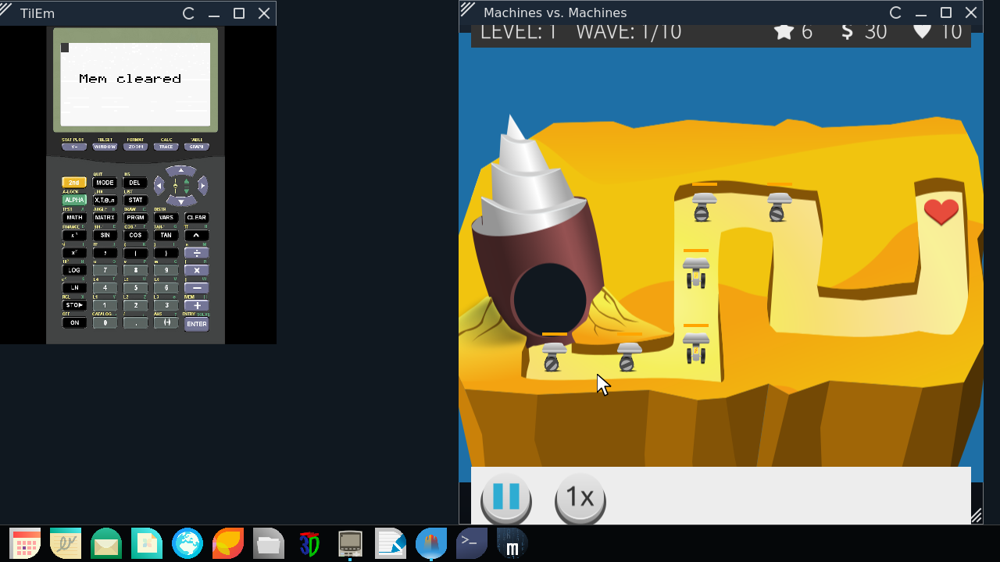
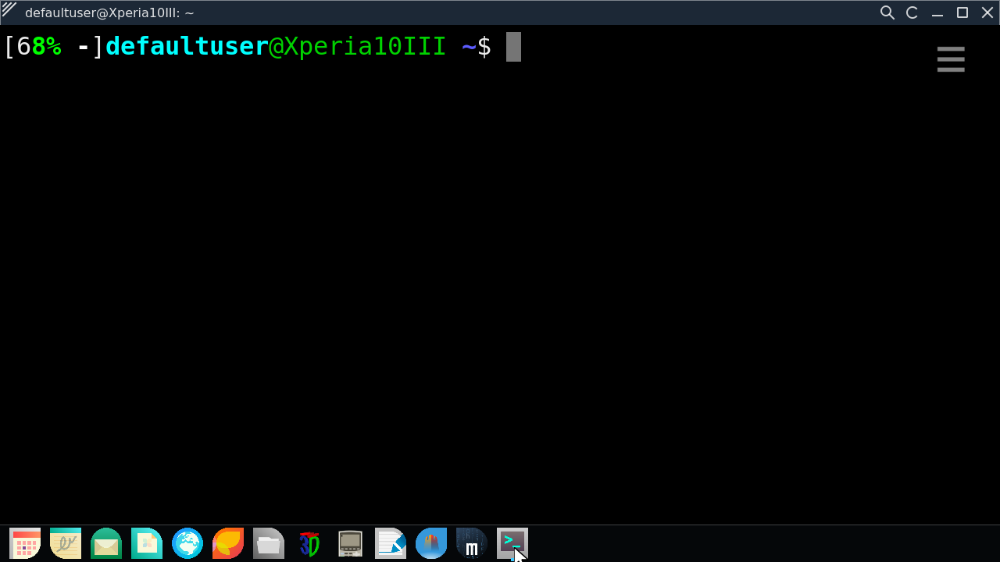
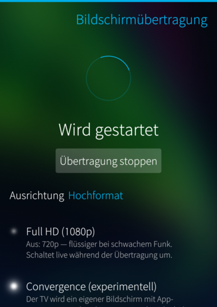
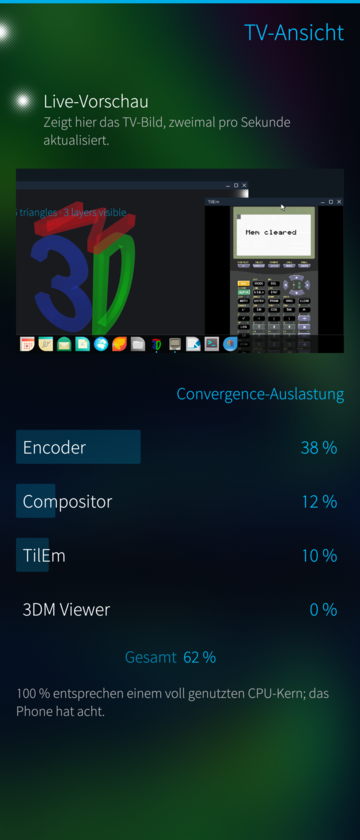
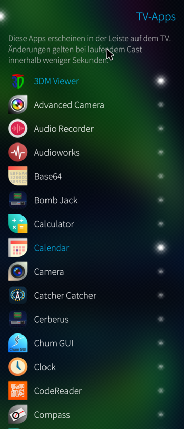

# Imira — Miracast screen mirroring for Sailfish OS

Mirrors the phone screen **and audio** to a Miracast sink — a TV or an HDMI
dongle — over Wi-Fi Direct. No app on the TV, no cables, no network required:
the phone talks to the sink directly.

<br clear="left">

As far as I know this is the first working Wi-Fi Display *source* for
Sailfish OS. Developed and tested on the **Xperia 10 III** (Sailfish OS
5.0.0.62) against a Microsoft Wireless Display Adapter V2 and an LG webOS TV
(native Miracast), using the phone's internal Wi-Fi chip.

**This is the convergence desktop running on a TV** — Sailfish apps as
windows, a dock, a mouse cursor, all driven by the phone; here a tower
defense game playing in a window next to a calculator emulator (screenshot
taken with the built-in Print-key capture, pixel for pixel what the TV
shows):



And this is real work on the same desktop: a terminal, maximized, driven by
a Bluetooth keyboard with a proper keymap (QWERTZ and friends) — the
phone-style on-screen keyboard stays out of the way:



<p>



</p>

## Features

- **Video**: screen capture via the Lipstick recorder interface, hardware
  H.264 encoding (droidmedia), MPEG-TS/RTP streaming. Live switch between
  720p and 1080p while casting.
- **Audio**: the phone's media output travels with the cast (LPCM). While
  casting, media playback is silenced locally — sound comes out of the TV
  only, and the volume keys control the TV loudness. Ringtones, alarms and
  calls deliberately stay on the phone. When the cast ends, playback returns
  to the phone speaker by itself.
- **Privacy by construction**: the capture verifies it reads a sink
  *monitor* and refuses anything else — the microphone can never leak into
  the stream. (Sailfish's audio policy actively tries to hand record streams
  the mic; see `device/imira-xpolicy.conf` for the counter-measure.)
- **Orientation**: automatic compensation keeps the TV image upright while
  the phone rotates; alternatively pin portrait or either landscape
  direction — for fullscreen games that use the gyroscope.
- **A/V sync**: live-adjustable audio offset (±2 s) from the app, applied
  without interrupting the cast.
- Device scan with sink selection, cast start/stop from the app, closing the
  app ends the cast.

## How it works

```
app (Silica UI)  ⇄  flag files in /tmp  ⇄  imira.service (root)
                                             ├─ bundled P2P wpa_supplicant
                                             │  (Wi-Fi Direct group, see vendor/)
                                             ├─ imira-wfd-proto.py
                                             │  (WFD RTSP handshake M1–M8)
                                             └─ imira-castd (user session)
                                                capture → convert/rotate →
                                                HW H.264 → MPEG-TS → RTP/UDP
```

The service runs only while the app does: the app starts it on launch
(gated by a polkit rule scoped to this one unit) and it exits by itself once
the app's heartbeat stops. Nothing runs at boot.

The stock Sailfish `wpa_supplicant` has P2P compiled out, so the service
ships its own build and runs it alongside the system one — nothing
system-wide is replaced. `vendor/README.md` has the one-line patch and the
recipe.

## Building

Three parts, built separately (Sailfish Platform SDK):

```sh
# 1. the streaming daemon (sb2 cross build, result: daemon/imira-castd)
daemon/build-castd.sh

# 2. the bundled P2P wpa_supplicant — see vendor/README.md

# 3. the app + packaging
mb2 -t SailfishOS-5.0.0.62-aarch64 build
```

## Status

Working end to end on the hardware above; other devices untested. Known
rough edge: playing videos in the Gallery **while casting** can crash the
Gallery's playback (hardware encoder and decoder share the video core; the
droid stack does not always survive that — other players cope better).

## Where this is heading: convergence

This project owes its direction to **Ubuntu Touch**. Years ago, Canonical's
phones did real convergence: plug in a keyboard and a mouse, put the screen
on a TV, and the phone turned into a desktop with proper, dockable windows.
The **Meizu Pro 5**, which shipped with Ubuntu Touch, was my gateway drug 
into Linux phones — and that experience never quite let me go.
When Canonical pulled the plug on it in 2017, that felt like a real loss:
the most convincing answer yet to "why would a phone be a computer?" simply
stopped. (It is no coincidence that Imira's Wi-Fi Direct code descends from
aethercast, Ubuntu Touch's display casting stack.)

A desktop computer may be needed for maybe 2–5% of personal
computing — most of the time it sits idle. For the few moments one
actually sits down in front of one, to write a letter, fill in a form,
things like that, no powerhouse of a PC is required — the phone would do,
if only it had the ability.

That ability is the goal of my little experiment: an occasional desktop
built from hardware you already own. Many TVs speak Miracast — no docking
station, no elaborate gear, as long as you accept the compromise of a
video stream (the encoder's latency is imperceptible while typing a
letter). And it makes no fundamental demands on the ecosystem: unmodified
Sailfish apps, windowed by a compositor they know nothing about. The aim
is not pixel perfection, but function that is willing to compromise —
there when it is needed.

Mirroring the screen was step one. Step two is here: the app has a
**convergence switch** (experimental) — instead of mirroring, the TV becomes
its own virtual screen (an own Wayland compositor, `daemon/comp/`), and
Sailfish apps launched onto it appear there as windows while the phone stays
fully usable. Window management works like a desktop today: move, resize
from every edge, minimize/maximize/close, a dock with user-selectable apps,
external keyboard (with a real keymap — qwertz included) and mouse, and TV
screenshots. Apps that insist on their phone layout get two per-window
escape hatches in the title bar: a rotation override and a zoom mode that
scales the app instead of asking it to relayout. Convergence on Sailfish.

## License

GPL-3.0-or-later. Parts of the Wi-Fi Direct and screen recording approach
are derived from the aethercast and screencast projects (GPL).
